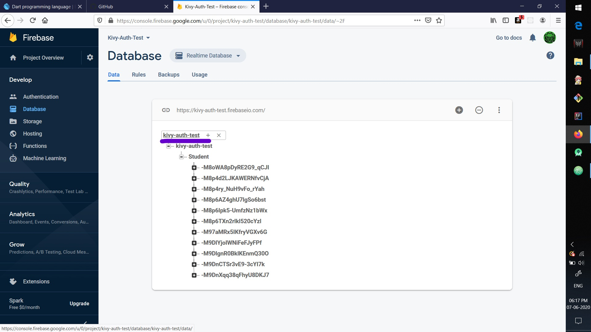

# Python_Kivy_Firebase-Authentication
*Python_Kivy_Firebase(Signup and Signin Authentication using helper library Pyrebase)*

## Cloning the project repository
```
git clone https://aniketambore/Python_Kivy_Firebase-Authentication-.git
```

<p><b> Installing the Requirements </b></p>
- Install Python-Kivy Framework [Kivy](https://kivy.org/doc/stable/gettingstarted/installation.html). <br>
- Install a simple python wrapper for the firebase api [Pyrebase](https://awesomeopensource.com/project/thisbejim/Pyrebase?categoryPage=9). <br>

## Create your Firebase Account
*Create a new project from your firebase account console*
- Copy your <b>firebase configuration</b> dictionary.<br>
Ex.
 <br><br>

## Open the cloned source code
<b><i>firebaseaut.py</i></b>
Paste Your <b>firebase configuration</b> dictionary here. <br>
 <br><br>

## Open your Firebase-Database Tab
Copy your database url from here. <br>
 <br><br>

<i>firebaseaut.py</i>
 <br><br>

## Copy the database table name as
 <br><br>

## Paste in here
```
firebaseaut.py
```
 <br><br>

## Run the project from your favourite IDE as
```
python main.py

```

# Output
 <br><br>

## Sign UP
 <br><br>

## If suppose you forgot your password
 <br><br>
                                          
<p>Click on Forgot Password and here you get the noreply email from firebase with a Reset Password link</p> <br>
 <br><br>

## Successfull Login


# Have Fun !!!
